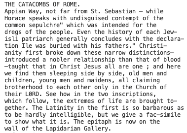

# Dependencies:
- OCRSpace token (generate from https://ocr.space/OCRAPI)
- Python 3.8.2
- requests (python package)

# OCR Comparision Metric:

This code finds the similarity in text of different images. It calls upon 
an API provided by OCRSpace. Reads in four images (Original, and three
segmented images) and prints out their similarity to the original to 
the console. 

All code written is my own with the exception of the 'ocr_space_file' 
function which was taken from the second link. The first link directs
you to the OCRSpace's API page that allows you to signup and generate 
a key to use their API. 

1. https://ocr.space/OCRAPI
2. https://github.com/Zaargh/ocr.space_code_example/blob/master/ocrspace_example.py

Once in the /QuantitativeAnalysisMetric subdirectory, to run you can
simply enter: 

```python OCRComparison.py``` or ```python3 OCRComparison.py```

Changing image files to run the OCR software upon is simply a matter
of changing the filepaths in the main function (All four paths
for comparisons for an image). 

# Example OCR Output

